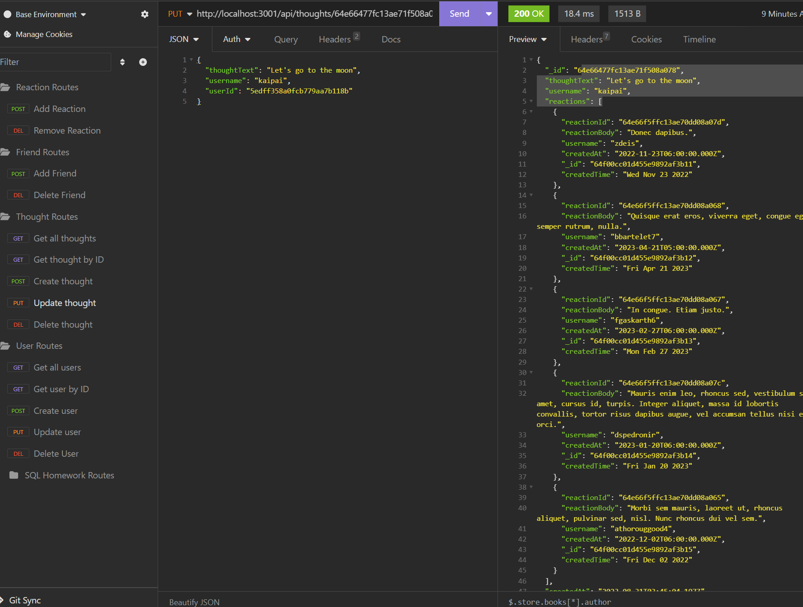

# NoSQL Social Network API

## Activity

- For this activity I created an API for a social network site that uses a NoSQL database.

## User Instructions

- To start, clone down the repo.
- Once cloned down run `npm i` to install the required packages.
- Next in the terminal type in `npm seed` if you would like to seed the database with the provided data.
- To start the application type in `npm start`.

- This application has the ability to:
  - Get all the users, get a user by ID, create a user, update a user, and delete a user.
  - Get all thoughts, get a thought by ID, create a thought, update a thought, and delete a thought.
  - Add a friend and delete a friend.
  - Add a reaction and delete a reaction. 

## Screenshot

- Here is a screenshot of the working application.

## Working Code Video Link

- Here is a link to a video of the working code.
[NoSQL Social Network API](https://drive.google.com/file/d/1jRoqT5bZqDo5iSLNj2IRI3vxJTYh9laF/view?usp=sharing)